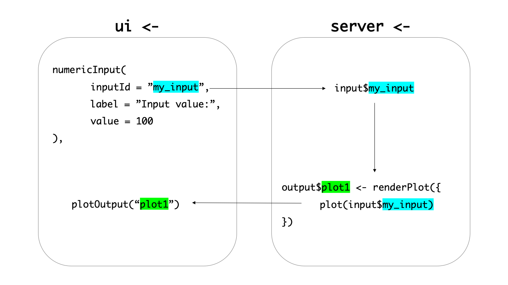

# 데이터의 흐름 {#reactive-chain}

샤이니를 알려면 먼저 데이터의 흐름을 알아야 합니다. 샤이니는 한쪽의 데이터가 바뀌면 연결된 다른 데이터들도 함께 바뀌는 데이터 흐름을 가지고 있습니다. 이를 반응성(Reactivity)이라고 합니다. 이러한 데이터의 흐름은 `ui`와 `server`를 넘나들며 하나의 체인처럼 연결되어 있고 이것을 반응성 체인(Reactive chain) 이라고 표현합니다. 예를 들어 살펴보겠습니다. 직접 코드를 실행해보지 않아도 됩니다. 자세히 들여다 봐주세요.

```{r eval=FALSE}
library(shiny)

ui <- fluidPage(
  
  numericInput(
    inputId = "my_input",
    label = "Input value:",
    value = 100
  ),
  
  plotOutput("plot1")
)

server <- function(input, output, session) {
  
  output$plot1 <- renderPlot({
    plot(input$my_input)
  })
}

shinyApp(ui, server)
```

1. `numericInput()`은 `input$my_input`에 `value = 100`이란 값을 부여합니다. 
2. `renderPlot()` 함수는 `input$my_input`에 지정된 값을 읽어 그래프를 그립니다.
3. 이는 `output$plot1 <- renderPlot()`이라는 객체에 지정됩니다.
4. 지정된 `plot1`은 `ui` 내에 `plotOutput("plot1")` 함수로 전달되어 UI에 그래프를 출력합니다.

```{r reactive-chain, fig.cap="샤이니 데이터들은 반응성 체인으로 연결되어 있다.", echo = FALSE, out.width = "60%", fig.align='center'}


```

비록 복잡하고 조금은 추상적인 내용이지만 샤이니에서 반응성 체인의 원리를 이해하는 것은 매우 중요하기 때문에 **여러번 읽으면서 꼭 이해하시길 바랍니다.** 이번 고개만 잘 넘기면 이제 기술적인 부분만이 남았습니다. 화이팅!


